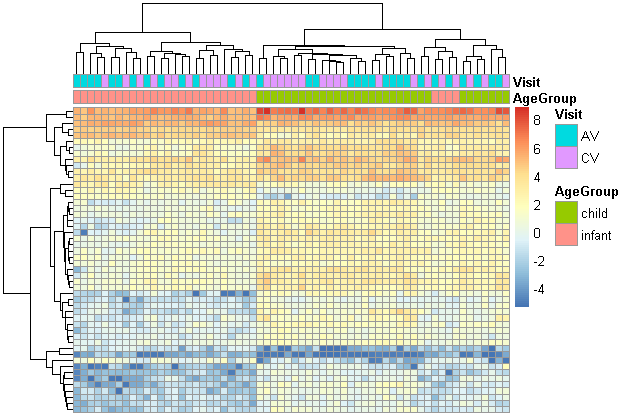

# *Análisis de expresión diferenciada en niños e infantes con bronquilitis viral aguda*

## **José Antonio Sánchez Villicaña**

## Introducción

Actualmente la plataforma de software open source para bioinformática **BioConductor** ofrece múltiples herramientas para el análisis de perfiles de expresión en distintos ensayos.

Paqueterías como **Recount3** ponen a disposición de manera accesible distintos datasets para realizar dichos análisis. Además, brindan al usuario una manera sencilla de ordenar programáticamente estos sets de datos de una manera estándar para su manipulación y procesamiento.

El presente ejercicio representa de manera básica el tipo de análisis de expresión diferencial, con un ensayo real, que se puede realizar de manera sencilla utilizando paqueterías de **R** encontradas en **BioConductor**. Como **Recount3**, **EdgeR**, **Limma** y paqueterías de visualización como **ggPlot2** y **Pheatmap**.

## Obtención del dataset

Para este análisis se utilizó el proyecto **SRP140558** obtenido a través de **Recount3**. Se trata de un ensayo en infantes humanos con la intención de caracterizar los mecanismos moleculares detrás de la hipersensibilidad observada a la bronquiolitis viral aguda. 

Se obtienen 15 pares de muestras de infantes (< 18 meses de edad) y 16 pares de muestras de niños (1.5 - 5 años de edad) durante el proceso infeccioso de bronquilitis aguda viral y después de un tratamiento estándar. La idea es observar patrones en las respuestas inmunológicas que ayuden a delucidar mecanismos moleculares que expliquen la anormal sensibilidad a la infección.

Los perfiles de RNA-Seq fueron generados utilizando secuenciación Illumina HiSeq2500, lecturas de 50pb single-end. 

## Exploración de los datos

A partir de una exploración de los atributos del experimento, determinamos que hay dos atributos de interés: grupo de edad (infantes o niños) y momento de visita (AV: durante la infección y CV: post-tratamiento).

Buscaremos determinar si hay diferencias significativas en los niveles de expresión antes y después del tratamiento entre los dos grupos de edades.

### Box-plot con la distribución de la proporción de conteos normalizados para los dos grupos de interés

Podemos ver que tenemos distribuciones similares, una vez normalizados los datos, entre ambos grupos de edades. Nos indica que podemos seguir con el análisis y descartar un posible sesgo al tomar las muestras. Hay algunos outliers para el grupo de los niños, pero la mayor parte de sus distribuciones están en los mismos rangos.

## Análisis de expresión diferencial

### MA-plot

Realizamos un MA-plot con la intención de confirmar la calidad de las muestras al buscar observar si se genera un sesgo hacia algún sentido de la expresión (sobreexpresión o subexpresión). 

Podemos decir que la mayoría de conteos están cayendo cerca de la línea media de 0 de expresión. Esto nos dice que no hay genes que están siendo demasiado sobrexpresados ni tampoco demasiado subexpresados. Lo que tiene sentido y hace que aquellos que sí están presentando niveles de expresión distintos sean posiblemente más significativos.

### Volcano plot

Realizamos un volcano plot buscando observar los niveles de expresión en ambos sentidos contra su significancia, calculada a través de un p-value. Buscamos determinar cuántas de nuestros conteos con un nivel mínimo de diferencia en su expresión (umbral determinado por nosotros en el eje x), están siendo explicadas por puro azar o realmente son parte de un mecanismo molecular involucrado en la hipersensibilidad a la infección.

Nosotros tendríamos que determinar una línea de corte en ambos sentidos de la expresión (sobrexpresados o subexpresados), pero aún sin hacerlo podemos observar que bastantes de nuestros conteos están superiores a un p-value significativo. Lo que nos confirma que es probable que sus niveles de expresión diferenciados no sean explicados por el azar, sino por realmente estar involucrados con algún mecanismo molecular aún sin descubrir. Dicho mecanismo molecular puede ser la explicación de la hipersensibilidad a la bronquilitis viral aguda en pacientes pediátricos.

## Visualización de los genes

### Heatmap considerando los grupos de edades y momentos de la visita

Podemos observar un agrupamiento lógico de los perfiles de expresión con respecto a los grupos de edades. Del lado izquierdo del heatmap se están clusterizando muestras del grupo de los infantes y del lado derecho se están juntando las de los niños, con un pequeño grupo de 4 genes en medio.

Por otro lado, los perfiles de expresión parecen ser independientes de la edad cuando se toma en cuenta el momento de la visita. Parece que independientemente de si la muestra se tomó antes o después del tratamiento, los perfiles de expresión responden más y se parecen más dependiendo de la edad del paciente.

Esto podría ser indicio de que existe un mecanismo molecular específico para infantes y otro específico para niños mayores de un año y medio de vida, responsable de la hipersensibilidad.

## Conclusiones

Habiendo analizado de manera superficial los perfiles de expresión de los pacientes muestreados, podemos llegar a dos posibles hipótesis que necesitarían un análisis más profundo para su validación. Parece haber expresión significativamente diferencial entre pacientes antes y después del tratamiento para la bronquilitis viral aguda. Debería analizarse la función de los genes identificados con una expresión alterada para delucidar exactamente este mecanismo que podría seer responsable de la hipersensibilidad a la infección. Pero también parece no haber correlación entre los perfiles de infantes y niños, lo que podría indicar que se tratan de dos mecanismos moleculares distintos causando dicha sensibilidad aumentada. Los cuales son dependientes de la edad del paciente. Esto llevaría a tratamientos especializados para pacientes en distintas etapas, los cuales ataquen específicamente estos mecanismos de manera diferente.

Por último parece relevante resaltar la facilidad que los paquetes mencionados en este análisis brindan a sus usuarios. Es realmente sencillo y con relativa poca necesidad de conocimiento previo del lenguaje de programación **R** el hacer un análisis de expresión diferencial. Desde obtener un dataset de entre una amplia base de datos, a su sencillo preprocesamiento, la normalización de los datos, hasta el mismo análisis y su visualización. Son herramientas accesibles que acercan a usuarios que pueden no tener un antecedente bioinformático muy fuerte a este tipo de análisis que puede complementar un proyecto de cualquier naturaleza biológica.
